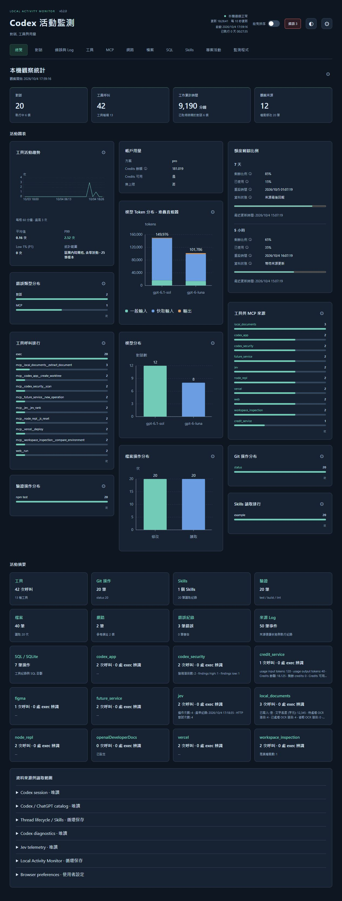
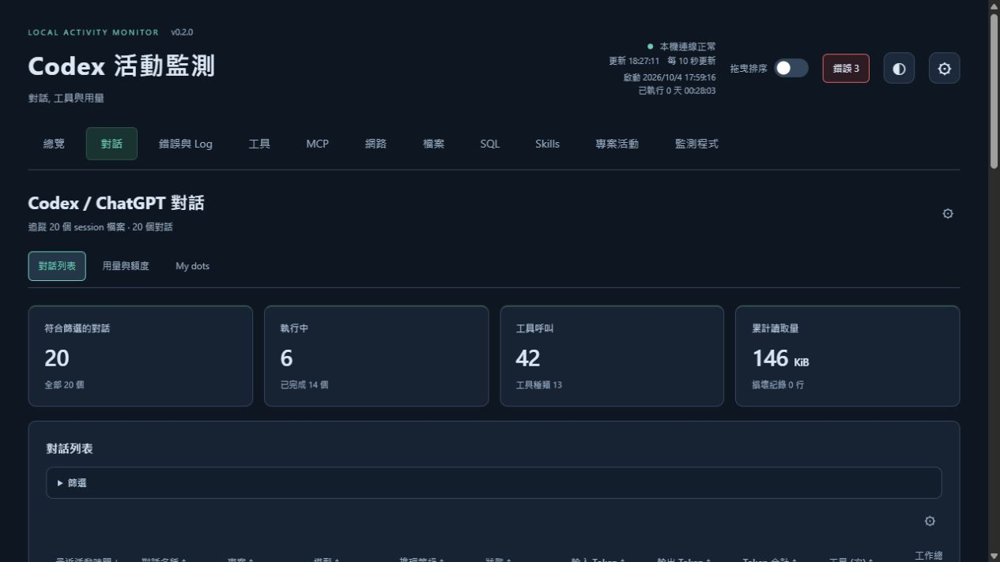
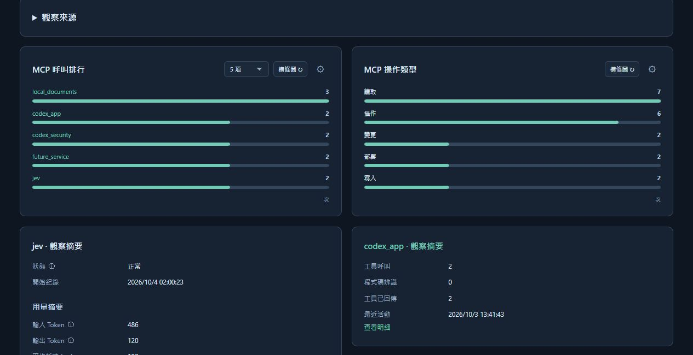
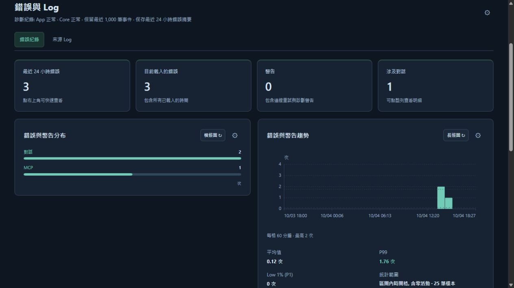

# Local Activity Monitor

Codex 活動監測, 包含 Jev 與 MCP. 使用 Python 標準函式庫與原生網頁, 不需 Node, GPU, API Key 或雲端服務

操作方式見 [使用說明](docs/usage.md), 資料來源與擴充方式見 [程式架構](docs/architecture.md), [設定檔格式](docs/settings-format.md) 與 [錯誤觀察](docs/error-observation.md). 維護與修改原則見 [維護與驗收](docs/maintenance.md). [活動匯出規劃](docs/export-plan.md) 保存後續功能需求. 可觀測欄位與取得限制見 [資料盤點](docs/data-inventory.md), 本輪檢查見 [驗證紀錄](docs/validation.md)

## 免安裝版與發布建置


| 套件 | 啟動方式 |
| --- | --- |
| windows-x64-cli.zip | `launch-cli.cmd`、`launch-cli.ps1` 或 `launch-cli.exe`, 只提供 CLI 入口 |
| macos-arm64-cli.tar.gz | Apple Silicon CLI, 雙擊 `launch-cli.command` 或執行 `launch-cli` |
| macos-x64-cli.tar.gz | Intel Mac CLI, 雙擊 `launch-cli.command` 或執行 `launch-cli` |


macOS 套件在 macOS 15 建置. 既有 Linux CLI 封裝保留, 以 Ubuntu 22.04 建置, 需要 glibc 2.35+. macOS 封裝使用 ad-hoc 簽章並檢查完整性, 未提供 Developer ID 簽章或 notarization. 系統要求安全性確認時, 依提示核對來源. SHA256SUMS.txt 可核對下載檔案

CLI 預設開啟本機監測頁面, 終端按 Ctrl+C 停止. 原生執行檔可加 `--no-browser` 停用自動開啟瀏覽器. 監測資料取自執行電腦上的 Codex 與 MCP 設定, 不隨套件附帶活動紀錄

## 從原始碼啟動

根目錄保留啟動入口、必要文件與設定. 啟動輔助程式與相依清單位於 `tools/`

本機開發可將 private 的 `workbench-ui` 儲存庫放在相鄰目錄, 或以 `WORKBENCH_UI_PATH` 指定其根目錄. LAM 直接讀取共用 UI, 不維護 CSS / JavaScript 副本. CLI 啟動時若沒有共用來源或離線資產, 會使用既有 Git 認證取得 `workbench-ui.json` 指定的 commit, 保存至本專案的 `.local/workbench-ui/<revision>` 並產生離線資產. 不修改鄰近儲存庫或固定版本, 不安裝相依套件. 缺少 Git、存取權限或網路時顯示原因, 既有資產異常時保留原內容並停止啟動. 發行版與原始碼下載包內嵌共用資產, 可離線使用

| --- | --- | --- |
| Linux | 使用瀏覽器介面 | `sh launch-cli.sh` |


缺少 Python 時顯示原因, 預設不詢問安裝、不下載 runtime. 若要明確啟用 Python 安裝流程, Windows 使用 `launch-cli.cmd --install-python`, macOS / Linux 使用 `sh launch-cli.sh --install-python`. 此流程仍須回答 `Install Python now? [y/N]`, 預設取消, 使用既有 Python Install Manager / winget、Homebrew 或 apt, 不自行安裝套件管理工具. 偵測時停用 Python Install Manager 的自動安裝

若偏好手動安裝 CLI, 在 repository 根目錄執行:

```sh
python -m venv .venv
python tools/prepare_ui.py --ensure
# Windows
.venv/Scripts/python.exe -m pip install -r tools/requirements.txt
# macOS / Linux
.venv/bin/python -m pip install -r tools/requirements.txt
```

`tools/requirements.txt` 安裝專案本身, runtime 沒有第三方套件相依, build 相依由 `pyproject.toml` 管理. 手動安裝可能需要下載 build 工具. 不會自動啟用 Jev 紀錄或安裝 Codex

原始碼啟動由 `tools/watch.py` 監看 Python 修改, 儲存穩定後只重啟自己建立的服務子程序. HTML / JS / CSS 在更新週期內重新載入. 瀏覽器的 Tab、排序、篩選、頁碼、外觀與觀察設定保留在 localStorage. 更新 launcher / watcher 或 runtime 時需重新啟動入口, watcher 不自動 pull 或更新相依. 直接呼叫已安裝的 CLI / wheel 不啟用 watcher

更新共用 UI 時執行 `python tools/prepare_ui.py --update`, 會以既有 Git 認證取得 Workbench UI 的 `main` 最新提交, 更新 `workbench-ui.json` 並產生離線資產. Workbench UI 必須處於乾淨的 `main`, 不會覆寫未提交內容或重寫歷史. 本機 CSS / JavaScript 更新依既有網頁更新週期套用, 更新載入器時需重啟 LAM. `--ensure` 只準備固定版本, 缺少來源時才自動取得, 不能與 `--update` 同時使用. 未指定這兩個選項時沿用既有本機來源與離線資產準備流程


也可安裝已建置的 `local_activity_monitor-0.5.1-py3-none-any.whl`, 再從安裝環境呼叫 `local-activity-monitor`

## MCP 來源紀錄

Dashboard 讀取來源實際的紀錄狀態, 不在啟動, 匯入或還原時改寫來源設定. 來源支援紀錄時, 請在該 MCP 啟用. Jev 的本機 telemetry 需要含 `jev_telemetry.py` 的新版 Jev client, 由 `codex-setup` 的 Jev wheel 或 managed Skill 安裝提供. 本 repo 不維護第二份 API client

```text
local-activity-monitor --enable-jev --configure-only
local-activity-monitor --codex --open
```

第一行明確啟用 metadata 紀錄, 只設定本機檔案. 不查 Jev API, 不讀 Key, 不送出專案資料. Jev CLI 與 MCP 讀取同一份設定

- 設定檔: `$CODEX_HOME/monitoring/jev-monitor.json`, 未設定 `CODEX_HOME` 時使用 `~/.codex`
- Windows 資料庫: `%LOCALAPPDATA%/local-activity-monitor/state/jev.sqlite3`
- macOS 資料庫: `~/Library/Application Support/local-activity-monitor/state/jev.sqlite3`
- Linux 資料庫: `$XDG_DATA_HOME/local-activity-monitor/state/jev.sqlite3`, 未設定絕對位置時使用 `~/.local/share`
- `--codex-home` 與 `--database` 可指定實際位置. Jev 與 dashboard 必須使用相同的 `CODEX_HOME`. Windows Store 虛擬化環境要確認兩個程序看到同一個資料庫

已開啟的 Jev MCP process 必須重新載入才會使用新版程式. 設定啟用後, 新版 client 每次操作讀取 opt-in 狀態. 不會回補舊 client 的歷史紀錄

```text
local-activity-monitor --disable-jev --configure-only
```

停用會保留已有紀錄. 個別 Jev process 也可設定 `JEV_TELEMETRY=0`. 清除歷史時先停用紀錄, 關閉 dashboard 與 Jev process, 再自行處理指定資料庫及 SQLite sidecar. 本工具不自動清除資料

## 顯示範圍

| 來源 | 觀察內容 | 限制 |
| --- | --- | --- |
| Jev | 已完成操作的 status, model, latency, HTTP 嘗試, body bytes, provider 回傳的 input/output tokens 與選定新增指標 | 一個操作完成時寫一列. 程序強制終止或資料庫不可寫時可能缺漏. 未知 usage 為 null |
| Codex / ChatGPT | 對話名稱, ID, 時間, 類型, 專案, 本機 / 雲端 / 遠端分類, 最新累計 counters, 工具名稱與次數 | 本機 catalog 提供 metadata. 雲端 token / 工具紀錄未提供時維持未知. fork 可能繼承 token counters |
| Codex Git | 工具呼叫中的 Git 操作, 時間, 工作目錄名稱與所屬對話 | 只辨識 literal 命令, 不主動執行 Git. 工具耗時屬於整次工具呼叫, 不等同單一 Git 命令耗時或成功 |
| Skills / 驗證 | SKILL.md 讀取, test / build / lint / type check 操作與所屬對話 | 讀取不等同使用. 不從工具已回傳推論檢查通過 |
| MCP | 各來源的工具, 操作類型, 時間, 結果, 耗時與選定摘要. 包含文件 / OCR, 環境 / 驗證, Runtime / 瀏覽器, Codex 工作流程, Review / Security, 部署與 App / 成果 | 自動辨識已設定與已出現的來源. 未知來源仍保留通用紀錄. 多個工具共用的回傳不拆成個別結果 |
| 網路參考 | Web 工具紀錄, 開啟與獨立回傳中的網址, 時間與對話 | 移除 query / fragment, 排除 URL credentials 與內部 IP. 動態 reference ID 未取得網址時維持缺值 |
| 工作 / 檔案 | 工作起訖累計耗時, literal 檔案讀取, apply_patch 與指定文字寫入操作的檔案位置 | 依可配對的工作起訖計算. 只辨識 literal 檔案操作, 不讀取檔案內文 |

Jev 不保存 query, rubric, state, candidates, answers, credential, header, 原始錯誤或私有來源路徑. 紀錄失敗不改變 Jev 的原本結果或錯誤處理. HTTP error body 不另讀取

Request bytes 是每次 HTTP 嘗試的 JSON body 大小. response bytes 只計已讀取內容, 未知部分另列. 不是 TLS / header / 網路流量或費用

Codex collector 從 JSONL, 本機 thread SQLite catalog, session index 與指定 app state 欄位選取 metadata, 不將完整原始紀錄, 一般對話文字或完整指令送到頁面. 不讀 `auth.json`, 憑證檔或 shell history. `exec` 中只辨識明確 literal 的 Git / Jev / Skills / 驗證操作, 不執行程式碼. 工具明細另外列出 `exec` 內辨識到的工具名稱, 包含動態參數的呼叫. 數量是程式碼出現位置, 不推論迴圈或條件分支的實際執行次數. 對話名稱優先取本機 catalog 的側邊欄顯示名稱, 缺少時才使用 session title / index. 分類依已記錄欄位, 缺少資料顯示未知

主頁整合總覽, 用量與額度, 對話, 專案, 工具, 資料操作, 錯誤與 Log, 監測程式. 對話包含列表 / 子代理程式 / 排程 / My dots, 專案包含列表 / Git / 驗證, 工具包含呼叫與耗時 / MCP / 技能 / Plugins, 資料操作包含網路 / 檔案 / SQL. 各子 Tab 的用途以 tooltip 顯示, 時間範圍由頁首全域選單控制, 舊頁面入口與圖表設定保留. 排程只讀取本機 metadata, 不顯示 prompt 或帳戶 ID. MCP 來源按鈕固定展開並自動換行. 左上版本與標題分開, 右上資訊區維持兩行, 集中連線狀態、額度剩餘、重設與更新時間. 每頁最下方的資料來源與讀取範圍維持全寬並預設收合, 展開可查看實際檔案位置, 選取欄位, 讀取結果, 目前保留量與程式上限

各分頁使用共用[卡片庫](docs/card-library.md), 可選趨勢, 比較, 排行, 分布與統計卡, 標籤分別列出類別與可用圖表形式. 總覽提供全部來源的圖表選項, 預設顯示 Model, 對話, 錯誤與用量, 每張副本有獨立參數. 主 Tab 摘要預設四項重要指標, 可設定數量, 項目, 名稱與順序, 副標優先顯示次要記錄值. 子 Tab 不顯示摘要卡或摘要設定. 圖表預設使用適合資料的形式, 可改選支援的形式, 時間圖另支援面積圖, 工具頁提供耗時分布. 多線圖預設 3 條, 可選 5 / 10 條. 有意義的平均值, P1 / P99, 總數與樣本範圍列在獨立統計卡, 各組以分隔線區分. 圖表保留刻度, 單位與完整 tooltip, 空資料顯示說明, 表格可使用全域或個別數值熱度. 程式碼中辨識到的工具預覽最多五行, 完整清單由明細視窗提供

右上拖曳開關預設關閉, 開啟後直接拖曳 Tab, 表頭, 圖表與卡片標題或活動摘要, 有插入位置提示. 各區獨立排序, 摘要指標的順序由頁面設定調整. 對話列只有一個相同明細入口, 關聯工具 / 對話使用按鈕. 狀態標籤依執行, 完成, 錯誤, 等待與回補分色, 保留文字與狀態確認時間

對話與 MCP 來源頁可點開特定 Jev 呼叫, 從該 session 尾端取得可觀察的送出 / 回傳內容, 在送至頁面前遮蔽 credentials, 不另存內容資料庫. 使用動態參數或多個工具共用回傳時可能沒有獨立的 Jev request / response. 缺少內容顯示 --. 不從 metadata 統計重建 payload

預設使用 Steam 深藍灰與淺藍配色, 可選其他主題, 強調色與深淺模式. 主設定與 Tab 設定採共用分類導覽, 依可視範圍與最小尺寸呈現, 切換分類時維持大小, 窄螢幕保留邊距, 設定選項靠右. 右上設定集中外觀, 顯示, 更新與追蹤, 介面與說明, 監測項目, MCP 來源, 來源紀錄與設定檔. 來源紀錄顯示來源實際狀態與更新時間, 缺少時間時顯示替代文字. 提供繁體中文, English 與日本語, 更新預設 10 秒 (1 - 3600), session 1 - 5000, 介面字級預設 14 px (12 - 18). 數量設定四捨五入為整數. 字級使用下拉選單, 選取後立即套用. 設定結果使用短暫浮動通知

介面與說明分工具, 介面文字與指標 tooltip, 有搜尋 / 分類, 有變更才顯示儲存與還原. 共用 tooltip 會避開邊緣並在 modal 開關時隱藏. 偏好保存於瀏覽器, 可匯入 / 匯出 JSON. 全部還原需先確認, 已有活動紀錄保留. 全域顯示選項預設 5 / 10 / 20 / 全部, 排行 5 項, 表格 10 筆. 圖表設定集中在卡片右上角齒輪, 分類趨勢可開啟合計線, 預設關閉, 包含全部分類且不占原有線數. 每張圖表與表格可獨立保存設定. 表格欄寬依內容安排, 時間在表格呈現兩行, 摘要與其他區域維持單行. Modal 的導覽按鈕與說明集中在 header, 工具說明的鉛筆緊接文字, 參考網址使用預設收合的逐筆清單. 既有有效自訂值保留, 還原預設後套用新數量與字級. Tag 以顏色區分狀態與分類, 同時保留文字

用量頁顯示來源提供的額度視窗, 剩餘比例, 重設時間與 credits, 摘要優先選擇已取得的資料, 依實際視窗長度命名. Token 分析依 thread 最新快照. 設定的監測項目可選擇「官方帳戶查詢」, 預設關閉, 啟用後透過已登入的 Codex CLI 唯讀取得方案, 額度與帳戶 Token 統計, 成功及失敗結果至少快取 60 秒. 讀取失敗時保留本機額度來源, 來源未提供的欄位維持未知

工具子頁包含 Plugins, 區分設定啟用狀態與本機快取, 顯示供應商, 版本, Skills 及 MCP 數量. 子代理程式從本機 spawn 關聯補齊, 狀態以工作開始 / 完成事件確認. MCP 與 SQL 內容只在開啟已記錄的操作時按需取得. 動態參數顯示記錄的呼叫程式碼, 不推算當時執行值, 混合回傳保留外層來源

My dots 與排程顯示本機可取得的 metadata, 雲端 Work, My dots 與排程來源尚未連接時明確標示. 本機空清單不代表雲端沒有資料. 官方帳戶查詢不提供這些雲端清單, 目前也未加入網路流量擷取

來源紀錄範圍預設 24 小時, 全域選單統一控制列表與操作統計. 最新狀態, 累計 Token 與帳戶額度保留來源快照. 專案資料夾, Global / Project AGENTS.md 與已觀察 Git 操作內容只在點明細時受限讀取, 不放入 snapshot 或 checkpoint

Token 使用每個 thread 最新累計快照. 不將每次快照或 last-turn counter 相加. cached input 與 reasoning output 是子項目, 不額外加到 total. 不彙整成帳戶總用量

檔案清單每 15 秒盤點. 預設最多 20 個近期 session 檔案, 開啟完整追蹤時最多追蹤 5000 個檔案, 依每輪 8 MiB 預算逐步讀取. 初次每個檔案讀取頭行與最多 1 MiB 尾端, 缺少狀態時在同一預算內向前回查工作開始 / 完成事件. 處理部分行, 檔案截短與損壞 JSON. catalog 最多提供 2000 個對話 metadata. 最近確認狀態與 500 筆 Skills 讀取 metadata 另保存至有上限的 checkpoint, 重啟後沿用並回補未涵蓋的紀錄

## 錯誤與常駐狀態

右上角"錯誤"顯示最近 24 小時已載入的錯誤數, 錯誤摘要在重整與重啟後保留, 點擊直接進入錯誤紀錄並篩選錯誤. 也可查看警告, 對話送出失敗, 連線重試, MCP / 工具回報錯誤, 命令非零代碼與觀察程式錯誤. 點整列可看原因分類, 時間, 模組, 代碼, Request / Trace / Call ID, 來源紀錄 ID 與相關事件. 不保存原始診斷訊息, stack 或私人對話內容

純 ChatGPT 雲端對話由本機 catalog 提供名稱, 時間與分類. 沒有 Codex session 或來源未提供的 Model / token / Reasoning 維持未知, 明細列出資料來源. 長時間工作的開始事件若超出尾端, 會分輪回查並補回狀態及可取得的起訖耗時

監測程式 Tab 顯示 uptime, Python / 平台 / 版本, 整理耗時與 CPU 趨勢, 讀取量, HTTP 回應, 資料保留與狀態事件. 程式保留最多 50000 個工具呼叫, 8 MiB 未完成片段, 360 個效能樣本與 200 個狀態事件. 舊資料依上限移除, 效能樣本與執行事件保存在記憶體. 本程式 Log 最多 128 KiB, 錯誤與 lifecycle / Skills checkpoint 各最多 512 KiB. 瀏覽器分頁隱藏時停止自動畫面更新, 回到分頁再更新, 後端仍依設定收集

## 畫面範例

以下四個頁面使用隔離環境產生的示範資料, 對話與專案名稱、用量數值及錯誤內容皆為虛構, 不含真實活動紀錄

### 總覽

彙整活動摘要、模型分布與工具趨勢, 可從卡片庫選擇要顯示的圖表



### 對話

查看對話狀態、Model 與 Token 統計, 表格可排序、篩選及開啟明細



### MCP 觀察

比較 MCP 來源的呼叫次數, 查看工具排行、操作類型與操作紀錄



### 錯誤紀錄

查看錯誤與警告的趨勢、類型分布及相關紀錄, 子分頁以 Badge 顯示錯誤數量



## 後續增加來源

新 MCP 的名稱由目前 `CODEX_HOME/config.toml` 與 session 中的 `mcp__來源__工具` 自動發現. 不需維護固定來源清單或電腦路徑. 現有 adapters 只提供已知欄位的摘要, 欄位缺漏或格式改變時保留通用工具紀錄. 新來源可在設定指定分類, 在工具文件補充用途. 增加特定業務摘要時擴充 `mcp_records.py`, 細節見 [程式架構](docs/architecture.md)

獨立於 Codex 操作紀錄的背景來源可新增 collector, 沿用 `source`, `health`, `scope` 與 timestamps. 額外背景服務或 native 相依採選用設定

## 開發與驗證

Windows PowerShell:

```powershell
$env:PYTHONPATH = "src"
python -m unittest discover -s tests -v
python -m pip wheel --no-deps --wheel-dir dist .
```

macOS / Linux:

```sh
PYTHONPATH=src python3 -m unittest discover -s tests -v
python3 -m pip wheel --no-deps --wheel-dir dist .
```

測試 checkout 時需先將 `src` 加入 `PYTHONPATH`, 避免載入其他已安裝版本. 測試使用臨時 metadata, 不呼叫付費 API. HTTP guard 直接測試實際 handler, watcher 測試僅操作自己建立的 mock 子程序. 本機 Codex 來源可唯讀檢查, 頁面開關與 Jev payload 使用隔離 fixture 驗證. 原生套件由各平台 CI 建置並執行隔離啟動檢查, macOS / Linux 的正式 Codex App log 格式仍需在目標環境確認, 結果見 [驗證紀錄](docs/validation.md)

Jev usage 欄位來源見 [TypeSafe API 文件](https://docs.typesafe.ai/api), Jev 只觀察 client 回應. Codex 的選配帳戶來源依 [官方 app-server 文件](https://learn.chatgpt.com/docs/app-server), 使用 account/read, account/rateLimits/read 與 account/usage/read, 不送出工作或修改帳戶

共用 JSON 顯示、Tag 與技能檔案樹狀清單來自獨立的 [Workbench UI](https://github.com/gaze9999/workbench-ui) private 儲存庫. LAM 提供資料與欄位說明, 共用元件負責呈現及互動. `workbench-ui.json` 指定完整 commit SHA, release workflow 使用 `WORKBENCH_UI_READ_TOKEN` 取得固定來源並呼叫共用 action. 發行版、wheel 與原始碼下載包附帶自動產生的資產與 SHA-256 manifest, 使用時不需 GitHub 連線. 共用來源版本不要求另建 Workbench UI release
