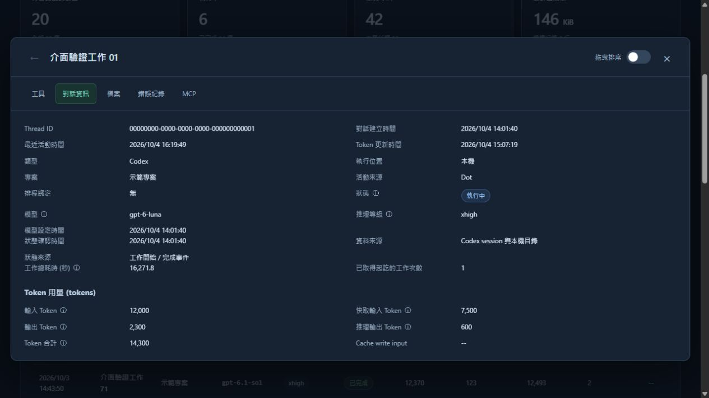
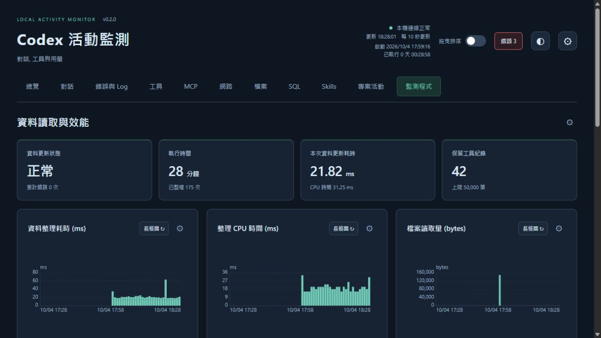
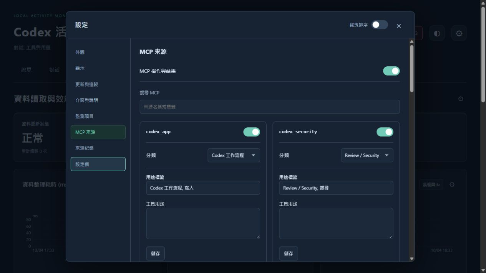

# Local Activity Monitor

Codex 活動監測, 包含 Jev 與 MCP. 使用 Python 標準函式庫與原生網頁, 不需 Node, GPU, API Key 或雲端服務

操作方式見 [使用說明](docs/usage.md), 資料來源與擴充方式見 [程式架構](docs/architecture.md), [設定檔格式](docs/settings-format.md) 與 [錯誤觀察](docs/error-observation.md). [活動匯出規劃](docs/export-plan.md) 保存後續功能需求. 本輪檢查見 [驗證紀錄](docs/validation.md)

## 下載即用

從 [Releases](https://github.com/gaze9999/local-activity-monitor/releases/latest) 下載符合系統與處理器的壓縮檔, 解壓縮後啟動. 原生套件包含 Python runtime, 不需自行安裝 Python 或套件

| 套件 | 啟動方式 |
| --- | --- |
| windows-x64.zip | Windows 10 / 11 x64, 雙擊 `Start.cmd` |
| macos-arm64.tar.gz | Apple Silicon, 雙擊 `Start.command` |
| macos-x64.tar.gz | Intel Mac, 雙擊 `Start.command` |
| linux-x64.tar.gz | x86-64 Linux, 執行 `sh start.sh` |
| linux-arm64.tar.gz | ARM64 Linux, 執行 `sh start.sh` |

macOS 套件在 macOS 15 建置, Linux 套件在 Ubuntu 22.04 建置, 需要 glibc 2.35+. 原生檔案未使用付費簽章或 macOS notarization, 系統可能要求確認來源. 保留整個解壓縮目錄, 不要只搬移執行檔. SHA256SUMS.txt 可核對下載檔案

各入口開啟本機監測頁面, 終端按 Ctrl+C 停止. 若不想自動開啟瀏覽器, 原生執行檔可加 `--no-browser`. 監測資料取自執行電腦上的 Codex 與 MCP 設定, 不隨套件附帶活動紀錄

## 從原始碼啟動

需要先有 Python 3.10+. Windows 雙擊 `Start.cmd`, macOS 雙擊 `Start.command`, Linux 執行 `sh start.sh`

首次啟動若尚未安裝, 入口會詢問 `Install and start now? [y/N]`. 輸入 `y` 後建立 repo 內的 `.venv`, 安裝 `requirements.txt`, 接著開啟監看頁面. Enter / `n` 取消且不安裝. 已安裝時直接啟動, 不重複安裝或自動升級. 不會自動下載 Python 本身

若偏好手動安裝, 以下指令在此 repo 執行

Windows:

```powershell
python -m venv .venv
.venv\Scripts\python.exe -m pip install -r requirements.txt
.venv\Scripts\local-activity-monitor.exe --codex --open
```

macOS / Linux:

```sh
python3 -m venv .venv
.venv/bin/python -m pip install -r requirements.txt
.venv/bin/local-activity-monitor --codex --open
```

原始碼版啟動入口會使用 repo 的 `.venv` 執行 checkout 的原始碼並開啟預設瀏覽器. 安裝失敗會保留錯誤, 下次缺少套件時可再確認重試. 已存在但損壞的 `.venv` 不會自動刪除或覆寫

使用 `Start.cmd` / `Start.command` / `start.sh` 啟動後可保持網頁開著. HTML / JS / CSS 修改會在更新週期內自動重新載入, Python 修改會由 `watch.py` 等待儲存穩定後重啟它建立的服務子程序, 原分頁重新連線. tab 與排序, 篩選, 頁碼, 外觀, 文案與觀察設定保留在此網站的 localStorage. 更新 launcher / watcher 本身, runtime 或 package 相依時仍需重新啟動入口或安裝. watcher 不自動 pull 或更新相依. 直接呼叫已安裝的 CLI / wheel 時不啟用原始碼 watcher

重複啟動時會檢查相同 port 與 CODEX_HOME 的 monitor, 開啟既有服務並結束新的啟動程序. 其他程式占用 port 時顯示訊息, 可自行指定另一個 port

macOS 若下載的檔案未保留執行權限, 在 repo 執行一次 `chmod +x Start.command`. 系統若要求安全性確認, 依 macOS 的提示檢查來源並處理, 不需停用系統防護

`requirements.txt` 安裝此專案本身. runtime 只使用 Python 標準函式庫, build 相依由 `pyproject.toml` 管理. 首次安裝可能需要網路下載 build 工具. 不會自動啟用 Jev 紀錄或安裝 Codex

入口皆加入 `--codex --open`. CLI 不加 `--codex` 時不讀 Codex sessions. 入口會保持服務終端開啟, 啟動失敗時保留錯誤訊息. 若重複開啟導致 port 已被使用, 使用既有頁面或先停止原本的服務

預設頁面是 `http://127.0.0.1:8787/`. 只能從本機連線. `--port 8790` 可指定其他 port. 終端按 Ctrl+C 停止, 關閉瀏覽器分頁不會停止服務

也可安裝已建置的 `local_activity_monitor-0.2.0-py3-none-any.whl`, 並從任意資料夾呼叫環境中的 `local-activity-monitor`. 不必保留 checkout

## MCP 來源紀錄

Dashboard 讀取來源實際的紀錄狀態, 不在啟動, 匯入或還原時改寫來源設定. 來源支援紀錄時, 請在該 MCP 啟用. Jev 的本機 telemetry 需要含 `jev_telemetry.py` 的新版 Jev client, 由 `codex-setup` 的 Jev wheel 或 managed Skill 安裝提供. 本 repo 不維護第二份 API client

```text
local-activity-monitor --enable-jev --configure-only
local-activity-monitor --codex --open
```

第一行明確啟用 metadata 紀錄, 只設定本機檔案. 不查 Jev API, 不讀 Key, 不送出專案資料. Jev CLI 與 MCP 讀取同一份設定

- 設定檔: `$CODEX_HOME/monitoring/jev-monitor.json`, 未設定 `CODEX_HOME` 時使用 `~/.codex`
- Windows 資料庫: `%LOCALAPPDATA%/local-activity-monitor/state/jev.sqlite3`
- macOS 資料庫: `~/Library/Application Support/local-activity-monitor/state/jev.sqlite3`
- Linux 資料庫: `$XDG_DATA_HOME/local-activity-monitor/state/jev.sqlite3`, 未設定絕對位置時使用 `~/.local/share`
- `--codex-home` 與 `--database` 可指定實際位置. Jev 與 dashboard 必須使用相同的 `CODEX_HOME`. Windows Store 虛擬化環境要確認兩個程序看到同一個資料庫

已開啟的 Jev MCP process 必須重新載入才會使用新版程式. 設定啟用後, 新版 client 每次操作讀取 opt-in 狀態. 不會回補舊 client 的歷史紀錄

```text
local-activity-monitor --disable-jev --configure-only
```

停用會保留已有紀錄. 個別 Jev process 也可設定 `JEV_TELEMETRY=0`. 清除歷史時先停用紀錄, 關閉 dashboard 與 Jev process, 再自行處理指定資料庫及 SQLite sidecar. 本工具不自動清除資料

## 顯示範圍

| 來源 | 觀察內容 | 限制 |
| --- | --- | --- |
| Jev | 已完成操作的 status, model, latency, HTTP 嘗試, body bytes, provider 回傳的 input/output tokens 與選定新增指標 | 一個操作完成時寫一列. 程序強制終止或資料庫不可寫時可能缺漏. 未知 usage 為 null |
| Codex / ChatGPT | 對話名稱, ID, 時間, 類型, 專案, 本機 / 雲端 / 遠端分類, 最新累計 counters, 工具名稱與次數 | 本機 catalog 提供 metadata. 雲端 token / 工具紀錄未提供時維持未知. fork 可能繼承 token counters |
| Codex Git | 工具呼叫中的 Git 操作, 時間, 工作目錄名稱與所屬對話 | 只辨識 literal 命令, 不主動執行 Git. 工具耗時屬於整次工具呼叫, 不等同單一 Git 命令耗時或成功 |
| Skills / 驗證 | SKILL.md 讀取, test / build / lint / type check 操作與所屬對話 | 讀取不等同使用. 不從工具已回傳推論檢查通過 |
| MCP | 各來源的工具, 操作類型, 時間, 結果, 耗時與選定摘要. 包含文件 / OCR, 環境 / 驗證, Runtime / 瀏覽器, Codex 工作流程, Review / Security, 部署與 App / 成果 | 自動辨識已設定與已出現的來源. 未知來源仍保留通用紀錄. 多個工具共用的回傳不拆成個別結果 |
| 網路參考 | Web 工具紀錄, 開啟與獨立回傳中的網址, 時間與對話 | 移除 query / fragment, 排除 URL credentials 與內部 IP. 動態 reference ID 未取得網址時維持缺值 |
| 工作 / 檔案 | 工作起訖累計耗時, literal 檔案讀取, apply_patch 與指定文字寫入操作的檔案位置 | 依可配對的工作起訖計算. 只辨識 literal 檔案操作, 不讀取檔案內文 |

Jev 不保存 query, rubric, state, candidates, answers, credential, header, 原始錯誤或私有來源路徑. 紀錄失敗不改變 Jev 的原本結果或錯誤處理. HTTP error body 不另讀取

Request bytes 是每次 HTTP 嘗試的 JSON body 大小. response bytes 只計已讀取內容, 未知部分另列. 不是 TLS / header / 網路流量或費用

Codex collector 從 JSONL, 本機 thread SQLite catalog, session index 與指定 app state 欄位選取 metadata, 不將完整原始紀錄, 一般對話文字或完整指令送到頁面. 不讀 `auth.json`, 憑證檔或 shell history. `exec` 中只辨識明確 literal 的 Git / Jev / Skills / 驗證操作, 不執行程式碼. 工具明細另外列出 `exec` 內辨識到的工具名稱, 包含動態參數的呼叫. 數量是程式碼出現位置, 不推論迴圈或條件分支的實際執行次數. 對話名稱優先取本機 catalog 的側邊欄顯示名稱, 缺少時才使用 session title / index. 分類依已記錄欄位, 缺少資料顯示未知

主頁整合總覽, 對話, 錯誤與 Log, 工具, MCP, 網路, 檔案, SQL, Skills, 專案活動與監測程式. 用量 / My dots, 錯誤 / Log, Git / 驗證與各 MCP 使用子 Tab. 左上版本與標題分開, 右上集中更新, 啟動與執行時間. 每頁最下方列出資料來源與讀取範圍

總覽依重要性預設顯示活動, 帳戶用量, 剩餘額度, Token 與錯誤等 12 個區塊, 可個別設定顯示與順序. 直條, 堆疊, 圓餅與環圈各自顯示, 與活動摘要分開. 圖表有刻度 / 單位, 耗時與趨勢提供平均值 / P99 / Low 1% (P1) 及含樣本數的範圍. 分類與額度不顯示分布統計. 長標籤統一傾斜並提供完整 tooltip. 桌面多欄表格在表格範圍內橫向捲動, 手機改成資料卡. 可選數值熱度, 同欄顏色依目前頁面數值比較

右上拖曳開關預設關閉, 開啟後直接拖曳 Tab, 表頭, 圖表與卡片標題或活動摘要, 有插入位置提示. 各區獨立排序, 頂部主要數值卡固定. 對話列只有一個相同明細入口, 關聯工具 / 對話使用按鈕. 狀態標籤依執行, 完成, 錯誤, 等待與回補分色, 保留文字與狀態確認時間

對話與 MCP 來源頁可點開特定 Jev 呼叫, 從該 session 尾端取得可觀察的送出 / 回傳內容, 在送至頁面前遮蔽 credentials, 不另存內容資料庫. 使用動態參數或多個工具共用回傳時可能沒有獨立的 Jev request / response. 缺少內容顯示 --. 不從 metadata 統計重建 payload

右上設定集中外觀, 顯示, 更新與追蹤, 介面與說明, 監測項目, MCP 來源, 來源紀錄與設定檔. 來源紀錄顯示來源實際狀態, 不改寫來源開關. 提供繁體中文, English 與日本語, 更新預設 10 秒 (1 - 3600), session 1 - 5000, 字體 12 - 18 px. 數量設定四捨五入為整數. 設定結果使用短暫浮動通知

介面與說明分工具, 介面文字與指標 tooltip, 有搜尋 / 分類, 有變更才顯示還原. 共用 tooltip 會避開邊緣並在 modal 開關時隱藏. 偏好保存於瀏覽器, 可匯入 / 匯出 JSON. 全部還原需先確認, 已有活動紀錄保留. 全域顯示選項預設 5 / 10 / 20 / 全部, 排行 10 項, 表格 20 筆

用量頁顯示來源提供的額度視窗, 剩餘比例, 重設時間與 credits, Token 分析依 thread 最新快照. MCP 用途取設定 / README 或自訂說明, 各來源動態列出工具與選定用量 / credits 指標. My dots 顯示可取得的產出類型與關聯對話. 名稱依來源可取得欄位套用

Token 使用每個 thread 最新累計快照. 不將每次快照或 last-turn counter 相加. cached input 與 reasoning output 是子項目, 不額外加到 total. 不彙整成帳戶總用量

檔案清單每 15 秒盤點. 預設最多 20 個近期 session 檔案, 開啟完整追蹤時最多追蹤 5000 個檔案, 依每輪 8 MiB 預算逐步讀取. 初次每個檔案讀取頭行與最多 1 MiB 尾端, 缺少狀態時在同一預算內向前回查工作開始 / 完成事件. 處理部分行, 檔案截短與損壞 JSON. catalog 最多提供 2000 個對話 metadata. 最近確認狀態與 500 筆 Skills 讀取 metadata 另保存至有上限的 checkpoint, 重啟後沿用並回補未涵蓋的紀錄

## 錯誤與常駐狀態

右上角「錯誤」顯示最近 24 小時已載入的錯誤數, 錯誤摘要在重整與重啟後保留, 點擊直接進入錯誤紀錄並篩選錯誤. 也可查看警告, 對話送出失敗, 連線重試, MCP / 工具回報錯誤, 命令非零代碼與觀察程式錯誤. 點整列可看原因分類, 時間, 模組, 代碼, Request / Trace / Call ID, 來源紀錄 ID 與相關事件. 不保存原始診斷訊息, stack 或私人對話內容

純 ChatGPT 雲端對話由本機 catalog 提供名稱, 時間與分類. 沒有 Codex session 或來源未提供的 Model / token / Reasoning 維持未知, 明細列出資料來源. 長時間工作的開始事件若超出尾端, 會分輪回查並補回狀態及可取得的起訖耗時

監測程式 Tab 顯示 uptime, Python / 平台 / 版本, 整理耗時與 CPU 趨勢, 讀取量, HTTP 回應, 資料保留與狀態事件. 程式保留最多 50000 個工具呼叫, 8 MiB 未完成片段, 360 個效能樣本與 200 個狀態事件. 舊資料依上限移除, 效能樣本與執行事件保存在記憶體. 本程式 Log 最多 128 KiB, 錯誤與 lifecycle / Skills checkpoint 各最多 512 KiB. 瀏覽器分頁隱藏時停止自動畫面更新, 回到分頁再更新, 後端仍依設定收集

## 畫面範例

以下使用隔離的示範資料, 顯示總覽, 對話明細, 錯誤紀錄與設定









## 後續增加來源

新 MCP 的名稱由目前 `CODEX_HOME/config.toml` 與 session 中的 `mcp__來源__工具` 自動發現. 不需維護固定來源清單或電腦路徑. 現有 adapters 只提供已知欄位的摘要, 欄位缺漏或格式改變時保留通用工具紀錄. 新來源可在設定指定分類, 在工具文件補充用途. 增加特定業務摘要時擴充 `mcp_records.py`, 細節見 [程式架構](docs/architecture.md)

獨立於 Codex 操作紀錄的背景來源可新增 collector, 沿用 `source`, `health`, `scope` 與 timestamps. 額外背景服務或 native 相依採選用設定

## 開發與驗證

Windows PowerShell:

```powershell
$env:PYTHONPATH = "src"
python -m unittest discover -s tests -v
python -m pip wheel --no-deps --wheel-dir dist .
```

macOS / Linux:

```sh
PYTHONPATH=src python3 -m unittest discover -s tests -v
python3 -m pip wheel --no-deps --wheel-dir dist .
```

測試 checkout 時需先將 `src` 加入 `PYTHONPATH`, 避免載入其他已安裝版本. 測試使用臨時 metadata, 不呼叫付費 API. HTTP guard 直接測試實際 handler, watcher 測試僅操作自己建立的 mock 子程序. 本機 Codex 來源可唯讀檢查, 頁面開關與 Jev payload 使用隔離 fixture 驗證. macOS / Apple Silicon / Linux 尚未在原生環境驗證

Jev usage 欄位來源見 [TypeSafe API 文件](https://docs.typesafe.ai/api). 本工具只觀察 client 回應, 不實作 Provider 帳戶用量查詢
